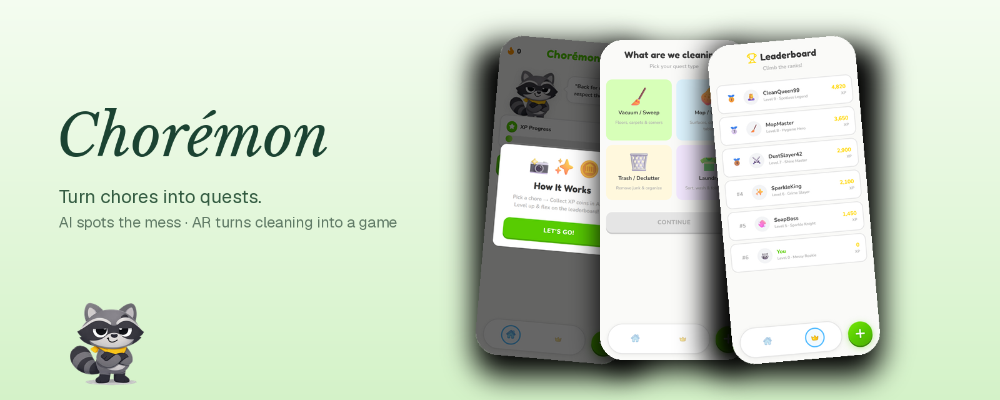

<div align="center">



# Chorémon

**Turn chores into quests.** Point your camera at the mess — AI finds it, AR turns cleaning it into a game you actually want to finish.

[**Live app**](https://choremon-six.vercel.app) · [**Devpost**](https://devpost.com/software/choremon) · [**Pitch video**](https://www.youtube.com/watch?v=QNTnY8eavig)


</div>

---

## What this is

Chorémon is a gamified chore app that turns a room into a quest board. No chore charts, no
nagging, no manual logging — you point a camera at the mess and the game builds itself.

| | |
|---|---|
| **The loop** | Scan the room → AI builds the quest → cleaning becomes AR gameplay → earn XP, keep your streak, climb the leaderboard |
| **AI vision** | Gemini API primary, with a resilient fallback chain (Featherless Gemma → OpenRouter → NVIDIA Nemotron) plus an on-device TensorFlow.js COCO-SSD path |
| **AR — Coin Mode** | WebXR + Three.js: coins are anchored to your real floor with a hit-test; you physically walk around collecting them while you clean |
| **AR — Tile Mode** | Unity + ARCore (Android): the floor is mapped into a tile grid and cleaned in real time as you vacuum over it |
| **Companion** | Rascal — a snarky raccoon with an ElevenLabs voice, emotion-tagged lines and idle detection |
| **Built at** | Hack Indy 2026 — MLH **Best Use of Gemini API** 🏅 |

## The four quests

| Quest | Mechanic |
|---|---|
|  **Vacuum / Sweep** | Scan the room → AR coins scatter across the floor → collect them all while you clean (Coin Mode), or map the floor and clear the tile grid (Tile Mode) |
|  **Mop / Wipe** | Same two AR modes, tuned for surfaces and corners |
|  **Trash / Declutter** | Photograph the mess → the AI vision pipeline returns a checklist of items with confidence (a trash bin is never listed as trash) → tick them off or dismiss |
|  **Laundry** | An 8-step checklist from sorting to putting clothes away, with per-step XP and Rascal commentary |

After every quest: XP, streak multiplier, and the family leaderboard — which, for kids and
roommates, is the whole point.

## How the AI sees the mess

Every camera frame is base64-encoded and classified live — no manual input.

```text
photo ──► Gemini API (primary)
            │ failure
            ▼
      Featherless AI (fine-tuned Gemma)
            │ failure
            ▼
      OpenRouter (same Gemma, routed)
            │ failure
            ▼
      NVIDIA Nemotron VL models (object detection / classification layer)
            │ failure
            ▼
      graceful mock data so the demo never dies
```

Responses are constrained to raw JSON (item ids, labels, locations, XP, a roast line), with
client- and server-side parsing that strips markdown fences before `JSON.parse`. Every fallback
exists because the hardest lesson of this build was that a chain of five models has five ways
to fail.

## Rascal, the companion

- **Voice:** ElevenLabs `eleven_multilingual_v2` (Finn voice), stability 0.35, similarity 0.75,
  style 0.6, speaker boost on — driven per line from the `rascal-speak` route.
- **Emotion tags:** lines carry inline tags like `[annoyed]`, `[sarcastic]`, `[sighs heavily]`
  that are passed raw to the voice model.
- **Never repeats:** lines are pre-written per category (greeting, laundry, trash, sweeping,
  dishes, idle) and tracked in a set until a category is exhausted.
- **He notices:** the first quip lands 8–15 s after a chore starts, then every 25–60 s — and if
  the `devicemotion` API sees acceleration drop below 1.5 for 12 s, Rascal calls you out.
- **SFX:** coin collection and quest fanfares are synthesized with Web Audio API oscillators at
  zero latency.

## Run it locally

```bash
git clone https://github.com/pfarell/choremon.git
cd choremon
npm install
cp .env.example .env.local     # fill in your keys
npm run dev                    # http://localhost:3000
```

| Variable | Used by |
|---|---|
| `GEMINI_API_KEY` (+ optional `GEMINI_API_KEYS`) | primary vision + chat |
| `NEXT_PUBLIC_GEMINI_API_KEY` | client-side Multimodal Live |
| `ELEVENLABS_API_KEY` | Rascal's voice |
| `OPENROUTER_API_KEY`, `FEATHERLESS_API_KEY` | trash-detection fallbacks |
| `OPENAI_API_KEY` | optional vision route |

Check connectivity for every service at once:

```bash
node tools/check-apis.mjs
```

## Deploy

- **Web app** — Vercel (Next.js 14 App Router). Set the env vars above in the project settings,
  then `vercel --prod` or connect the repo.
- **Tile Mode APK** — build the Unity/ARCore scene for Android and sideload it on the demo
  device. The web app hands off with `choremon://ar?mode=tile`; Unity reads
  `Application.absoluteURL` and returns coverage data on completion so XP can be awarded.

## Engineering record

The full decision log — AR platform evaluation, the deep-link handoff, tile-coverage math,
the voice architecture and the honest limits — lives in [docs/ENGINEERING.md](docs/ENGINEERING.md).

## Team

Built in 44 hours at **Hack Indy 2026** by:

- [Praditya Farell](https://github.com/pfarell) — AR modes, web app, AI pipeline
- [Winner R. Rasendriya](https://github.com/winnrras) — AI pipeline, Unity/ARCore, web app

## Honest limits

- **iOS:** WebXR needs Mozilla's experimental *XRViewer* app (no MacBook in the team → no
  ARKit build). Android browsers run Coin Mode natively.
- **Tile Mode is Android-only** — it ships as a sideloaded Unity APK, not on the web.
- **Keys:** the hosted demo runs on the authors' keys; when quotas run out it degrades to mock
  data by design. Running locally needs your own keys.
- **No license file yet** — this is a co-authored hackathon project; please talk to the authors
  before reuse.
